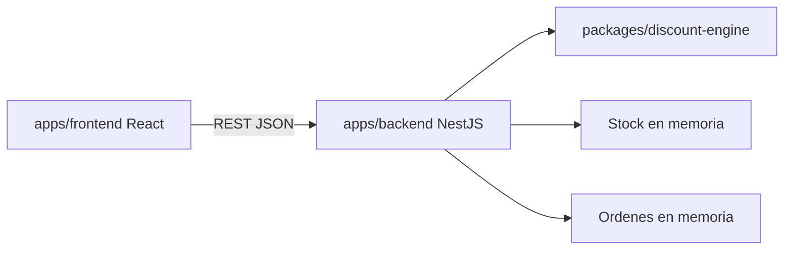

# SDD — Core E-Commerce Checkout (descuentos acumulativos)

Documento de diseño del MVP de la prueba técnica. Código, contratos y estructura: este monorepo. Repo público: https://github.com/pipeelyo/examen-ecommerce

## 1. Propósito

Checkout de e-commerce que:

- Muestra productos y un carrito reactivo (HU1).
- Aplica cupón y muestra desglose (HU2).
- Recalcula en backend, valida stock, persiste la orden (HU3).
- Alerta si el ahorro llega al tope del 35% (HU4).

## 2. No-goals (MVP)

Pagos reales, usuarios/login, catálogo admin, envíos, impuestos, multi-moneda, Redis, RabbitMQ, Firebase. La demo de 20 min corre en local; el cloud es GKE Autopilot en `round-seeker-309101` (cluster `ecommerce`), sin los pods de Kata E1.

## 3. Contenedores



El motor no conoce HTTP ni persistencia.

## 4. Stack y por qué

| Capa | Elección | Motivo |
| --- | --- | --- |
| Front | React + Vite + TypeScript | Sustentación rápida, tipado, mismo stack ya usado |
| Back | NestJS + TypeScript | Módulos claros, Swagger, tests |
| Contratos | `packages/discount-engine` | Una sola implementación de la matemática |
| Persistencia MVP | Memoria (Map) detrás de un puerto | El enunciado lo permite; Adapter para cambiar a SQLite después |
| Tests | Vitest | Mismo runner front/back/package, cobertura 80% |

Trade-off: memoria se pierde al reiniciar. A cambio, cero infra para la demo. Extensibilidad: repositorio con interfaz `OrderStore`.

## 5. Motor de descuentos (núcleo)

Orden **secuencial multiplicativo**, no suma de porcentajes.

Sea `S0 = Σ (precio × cantidad)`.

1. **Categoría:** 10% solo sobre líneas `Tecnologia`. `S1 = S0 − 0.10 × Σ líneas tech`.
2. **Volumen:** si `S1 > 100 USD`, 5% sobre **todo** el carrito ya ajustado: `S2 = S1 × 0.95`; si no, `S2 = S1`.
3. **Cupón** `WELCOME2026`: 15% sobre `S2`: `S3 = S2 × 0.85`. Otro código o vacío: `S3 = S2`.
4. **Tope:** `descuento = S0 − S3`. Si `descuento / S0 > 0.35`, entonces `payable = S0 × 0.65` y `capApplied = true`.

Ejemplo (carrito 100% Tecnología, S0 = 160):

- Categoría: −16 → S1 = 144
- Volumen (144 > 100): ×0.95 → S2 = 136.80
- Cupón: ×0.85 → S3 = 116.28
- Efectivo = 27.325% < 35% → no hay tope

**Hecho de diseño:** con las tres tasas publicadas, el máximo teórico si todo es Tecnología y hay volumen+cupón es `1 − 0.9×0.95×0.85 ≈ 27.3%`. El tope del 35% no se dispara con `WELCOME2026` solo. Aun así el cap se implementa: es la red de seguridad que pide el enunciado y se cubre en tests inyectando un escenario que sí lo supera (pipeline de prueba). HU4 se pinta cuando el backend manda `capApplied: true`.

## 6. Patrones (mínimo dos, en código)

1. **Strategy** — cada regla es `DiscountStep { name, apply(ctx) }`: categoría, volumen, cupón.
2. **Pipeline (Chain)** — `DiscountPipeline` aplica los steps en el orden fijo 1→2→3 y luego el cap.
3. **Adapter** — `InMemoryOrderStore` e `InMemoryCatalog` implementan puertos; controladores no tocan `Map`.

Front: estado del carrito con store observable (Observer) para subtotal y alerta.

## 7. Contratos REST

`GET /api/products` — catálogo con stock.

`POST /api/quotes` — preview sin persistir ni descontar stock.

```json
{ "lines": [{ "productId": "p1", "quantity": 2 }], "couponCode": "WELCOME2026" }
```

Respuesta: `originalSubtotal`, `breakdown` (category, volume, coupon, total, effectivePercent, capApplied), `payable`, `lines`.

`POST /api/orders` — checkout: valida stock, recalcula, decrementa stock, guarda orden, devuelve lo mismo + `orderId`.

Errores: carrito vacío `400`, cupón desconocido `400`, sin stock `409`.

## 8. Catálogo semilla (demo)

Productos fijos en memoria, p. ej. laptop Tecnología $80, mouse Tecnología $25, silla Hogar $90, camiseta Ropa $20, stocks bajos en uno para HU de stock.

## 9. Frontend

- Lista de productos + agregar/quitar.
- Subtotal original en vivo (cálculo local de S0; desglose oficial solo tras quote/checkout del API).
- Input cupón + Aplicar → `POST /api/quotes`.
- Desglose visible. Si `capApplied`, banner persistente: «¡Enhorabuena! Has alcanzado el límite máximo de ahorro permitido (35%)».
- Confirmar orden → `POST /api/orders`.

El front **no** es la fuente de verdad del descuento.

## 10. Pruebas (≥ 80% en capas lógicas)

Package engine: cascade, tope 35%, carrito vacío, cupón inválido, mix tech/no-tech, umbral exactamente $100 (no aplica volumen).

Backend: stock insuficiente, orden persistida, quote no muta stock.

Front: carrito, banner cuando `capApplied`, no banner si no.

## 11. Relación con Kata E1 / GCP

Misma familia (React, Nest, OpenAPI, WIF, Artifact Registry, Autopilot). El examen **no** lleva Redis, RabbitMQ ni Firebase. Cluster y registry propios (`ecommerce`), 1 réplica, LoadBalancer solo en el front. Persistencia del checkout: memoria. Auth no entra en el MVP.

## 12. Backlog de implementación

1. Implementar `DiscountPipeline` + tests del package.
2. Nest: products, quotes, orders + Swagger + tests.
3. React: carrito, cupón, desglose, alerta, checkout.
4. Completar `docs/ia.md` con dos rechazos reales de IA al escribir el motor.
5. README con comandos de test/cobertura.
6. Repo público GitHub + commits incrementales.
